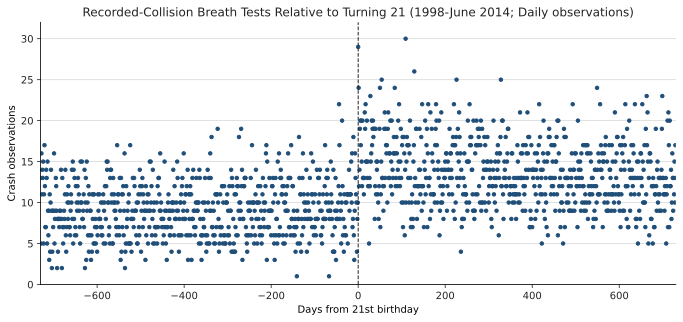
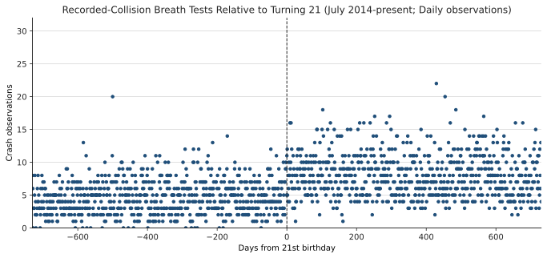
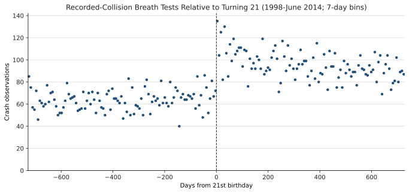
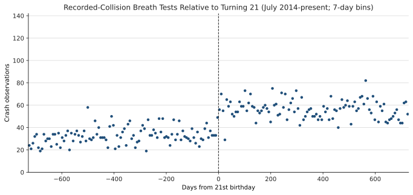
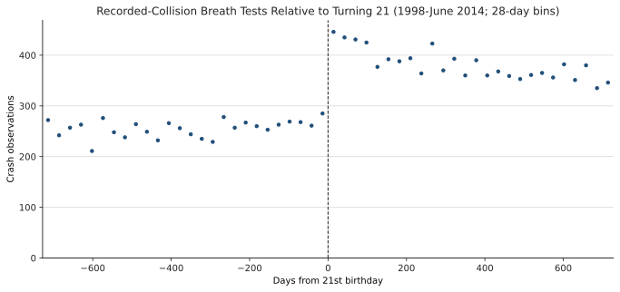
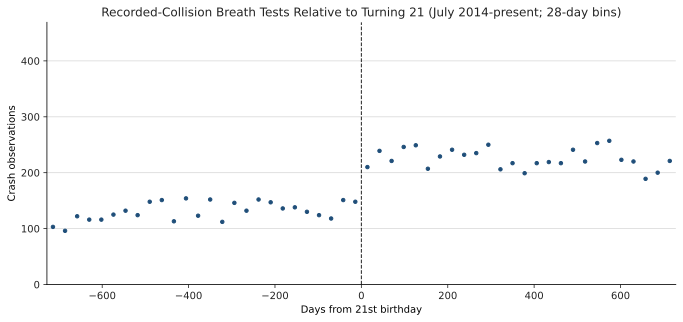

# Recorded-Collision Breath Tests Relative to Age 21

## Design

The outcome is the daily count of de-duplicated breath-test observations marked as involving a recorded collision. Each sample covers two years on either side of the tested person's 21st birthday. The first period ends in June 2014; the second begins in July 2014, when legal adult cannabis sales began in Washington.

The threshold estimates use a local Poisson count model within 90 days of age 21, with a post-21 indicator and separate linear trends on each side. The reported percentage jump is `100*(exp(beta)-1)`; standard errors use the robust delta method.

## Age-21 Crash Jump

| Period | Percentage jump at 21 | Relative-day cells |
| --- | --- | --- |
| 1998-June 2014 | +63.5% (robust SE 16.5); p=0.000 | 181 |
| July 2014-present | +34.4% (robust SE 18.6); p=0.032 | 181 |

## Daily Counts

| 1998-June 2014 | July 2014-present |
| --- | --- |
|  |  |

## 7-Day Bins

| 1998-June 2014 | July 2014-present |
| --- | --- |
|  |  |

## 28-Day Bins

| 1998-June 2014 | July 2014-present |
| --- | --- |
|  |  |
