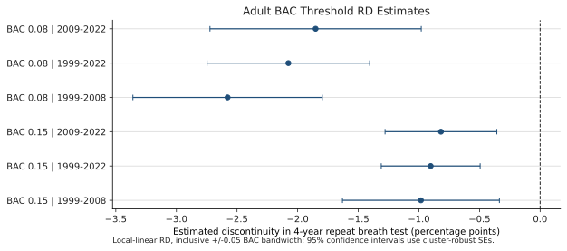
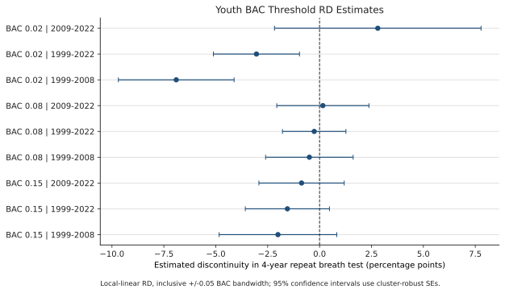

# Washington Breath Tests and Four-Year Recidivism RD Estimates

## Summary

- **Adult thresholds show lower four-year repeat breath-test rates just above both BAC cutoffs.** At .08, the estimated discontinuity is -2.58 percentage points in 1999-2008, -2.08 points in 1999-2022, and -1.85 points in 2009-2022.
- **At the adult .15 aggravated-DUI threshold, the estimated discontinuity is smaller but still negative across all three cohorts.**
- **For drivers younger than 21, the .02 discontinuity is negative in the earlier and longer cohorts but is imprecise in the 2009-2022 cohort.** The .08 and .15 youth estimates are also imprecise.

## Breath-Test Patterns

The descriptive figures use de-duplicated Washington breath-test observations from 1995 through 2026.

| By day of week | By day of month |
| --- | --- |
|  |  |

## RD Design

Each model estimates a local-linear regression discontinuity in the probability of a subsequent breath test within four years. The running variable is the lower recorded BAC, and the treatment indicator turns on at the stated BAC threshold. The estimation window includes observations within +/-0.05 BAC points of the cutoff. Standard errors are cluster-robust by integer BAC score. The 1999-2022 and 2009-2022 cohorts include only index tests with complete four-year follow-up; 2022 therefore ends on June 17.

Adults are age 21 and older with the adult DUI crime code. Youth are ages 18-20 with the applicable adult or under-21 code. Estimates are percentage-point discontinuities; standard errors and sample sizes appear in parentheses and after the semicolon.

## Adults: Four-Year Repeat Breath Test

| BAC threshold | 1999-2008 | 1999-2022 | 2009-2022 |
| --- | --- | --- | --- |
| 0.08 | -2.58 pp (0.40); N=110,318 | -2.08 pp (0.34); N=216,175 | -1.85 pp (0.44); N=105,857 |
| 0.15 | -0.98 pp (0.33); N=170,129 | -0.90 pp (0.21); N=326,372 | -0.82 pp (0.24); N=156,243 |

## Youth Ages 18-20: Four-Year Repeat Breath Test

| BAC threshold | 1999-2008 | 1999-2022 | 2009-2022 |
| --- | --- | --- | --- |
| 0.02 | -6.90 pp (1.42); N=9,540 | -3.04 pp (1.06); N=15,467 | +2.80 pp (2.54); N=5,927 |
| 0.08 | -0.49 pp (1.08); N=18,136 | -0.26 pp (0.78); N=29,277 | +0.16 pp (1.13); N=11,141 |
| 0.15 | -2.00 pp (1.45); N=14,250 | -1.55 pp (1.03); N=23,999 | -0.87 pp (1.05); N=9,749 |

## Interpretation

The estimates are local associations around administrative BAC thresholds, not estimates of the effect of alcohol consumption itself. A negative coefficient means that otherwise comparable observations just above the threshold have a lower estimated probability of another breath test within four years. The adult estimates are consistently negative; the youth models have substantially less precision, especially in the later cohort.

The source table is `tables/threshold_recidivism_rd.csv`.
