# Washington Breath-Test Trends Through 2026

## Executive Summary

- **Testing volume rose through the late 1990s, stayed high through the 2000s, and then declined.** The 2018-2019 overlap has been removed before constructing these series.
- **Breath-test observations rise sharply at age 21.** The pattern is visible at daily, weekly, and 28-day resolutions in the two years on either side of the 21st birthday.
- **The age-21 discontinuity is smaller after July 2014, when legal adult cannabis sales began in Washington.** A local-linear comparison within 90 days of age 21 estimates a 44.5% increase before the policy break and a 36.4% increase after it. This is preliminary descriptive evidence consistent with substitution, not a causal estimate.

## Aggregate Breath-Test Patterns

The figures below use de-duplicated breath-test observations from 1995 through 2026. They describe tests, not the population rate of impaired driving.

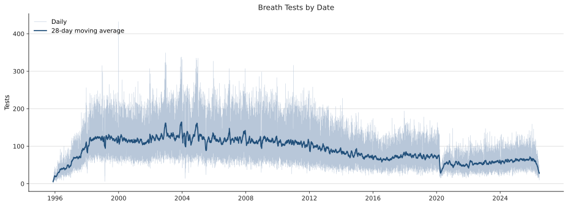

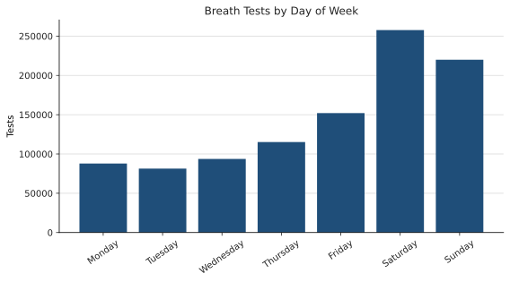

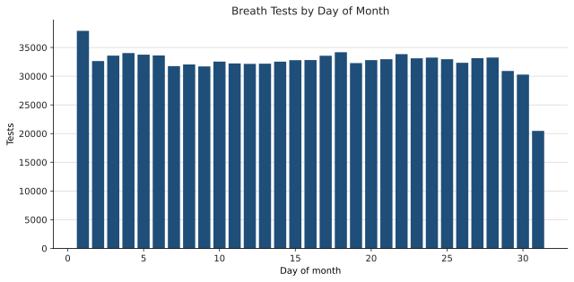

## Observations Relative to Turning 21

Each plot places a test by the number of days from the tested person's 21st birthday. The daily figure shows the raw day-level counts; the other two smooth that same pattern into complete 7-day and 28-day bins. Partial outer bins are excluded.

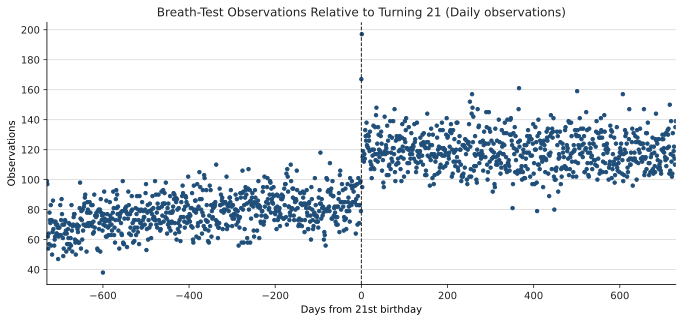

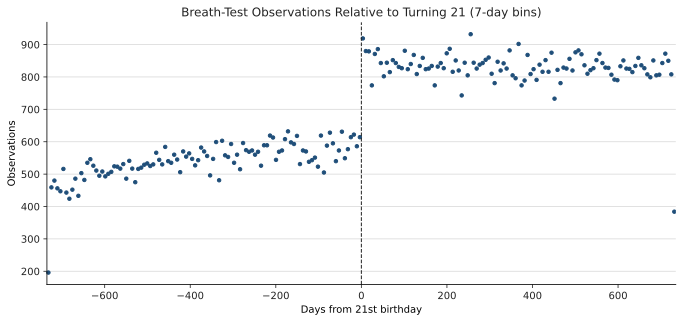

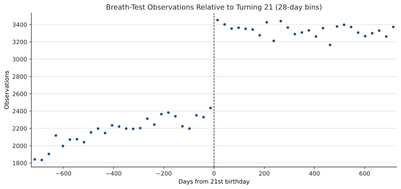

## Age-21 Count Sensitivity

The same age-21 count design is repeated after excluding zero BAC readings and then within tests with a recorded collision. These restrictions address the sharp rise in exact-zero BAC records over time and provide a smaller, potentially more consistently recorded comparison sample. Each plot uses its own vertical scale.

### BAC > 0

| Daily observations | 7-day bins | 28-day bins |
| --- | --- | --- |
| 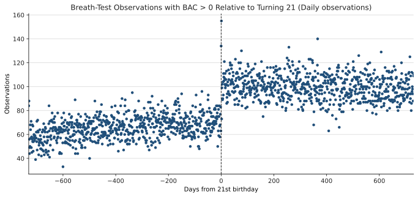 | 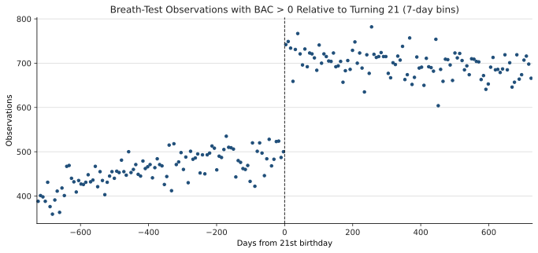 | 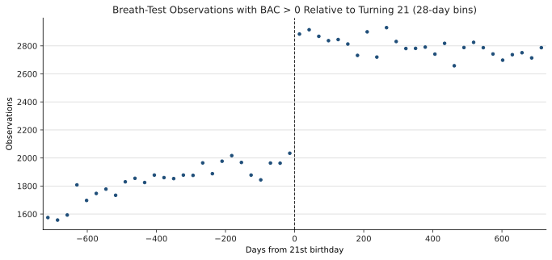 |

### Recorded collision

| Daily observations | 7-day bins | 28-day bins |
| --- | --- | --- |
| 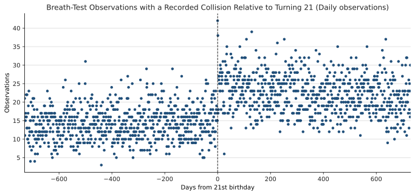 | 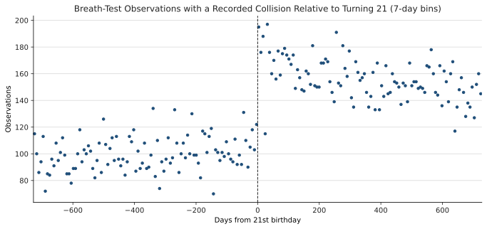 | 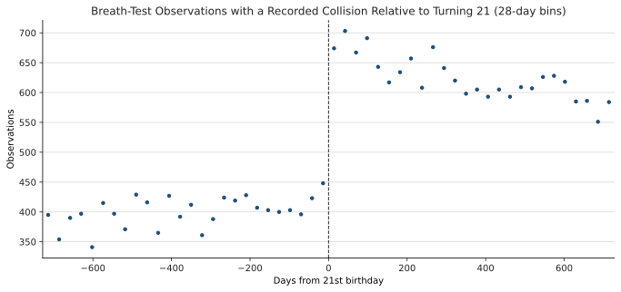 |

## Age-21 Pattern Before and After Legal Cannabis Sales

The pre-period runs from January 1999 through June 2014. The post-period begins in July 2014 and runs through the latest available record. Within each row, the two plots use the same y-axis scale. The age-21 jump persists in both periods, but is proportionally smaller after July 2014.

### Daily observations

| 1999-June 2014 | July 2014-present |
| --- | --- |
| 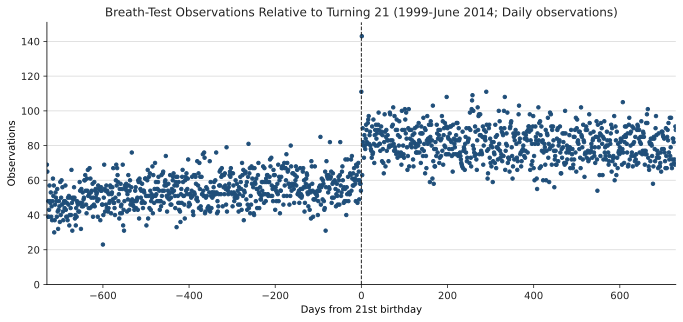 | 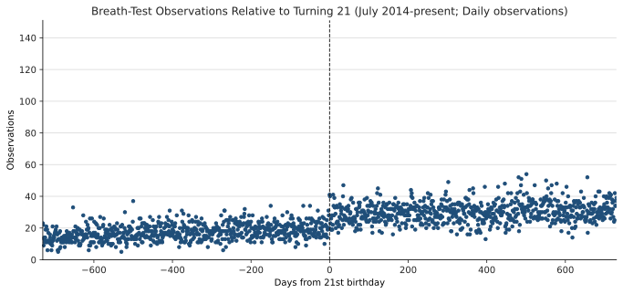 |

### 7-day bins

| 1999-June 2014 | July 2014-present |
| --- | --- |
| 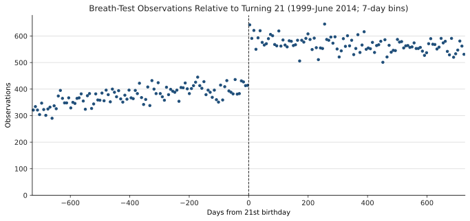 | 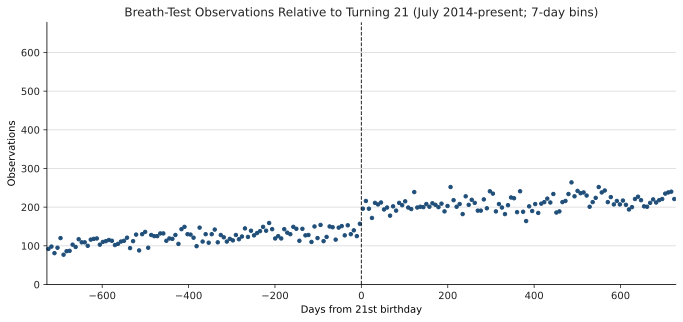 |

### 28-day bins

| 1999-June 2014 | July 2014-present |
| --- | --- |
| 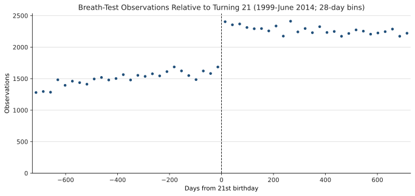 | 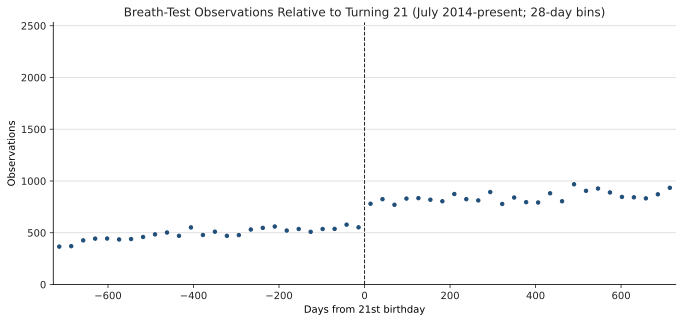 |

## Interpretation and Next Steps

The difference in age-21 discontinuities is consistent with some substitution away from alcohol when legal cannabis access begins at the same threshold. Because the analysis is based on breath-test observations, the result remains sensitive to changes in testing and enforcement that differ specifically at age 21. Useful next checks are placebo age cutoffs, broader national policy variation, and California discharge data that provide an outcome outside breath-test enforcement.
